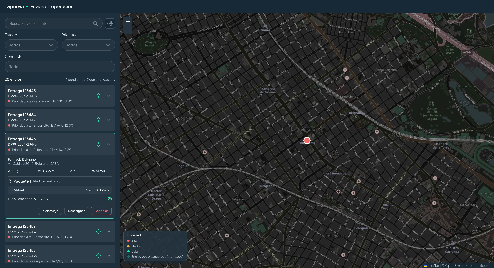

# Envíos en operación

Dashboard para que un operador logístico siga los envíos del día: listado, mapa, filtros, detalle y acciones, construido sobre el UI Kit de Figma.



## Cómo correrlo

Requiere Node 24 y pnpm 10.

```bash
pnpm install
pnpm dev     # http://localhost:5173
pnpm check   # lint, formato, tipos, código sin usar y tests con coverage
```

No hay backend: el store arranca con datos mock (20 envíos, 5 conductores y 5 vehículos en AMBA), con fechas relativas al día actual.

## Qué hace

- **Listado** ordenado por prioridad y ETA, con un resumen (total, pendientes, prioridad alta). Cada card se expande con métricas, paquetes y asignación.
- **Mapa** sincronizado con el listado: seleccionar en uno selecciona en el otro, "Ubicar" centra el envío y el mapa se reencuadra al filtrar.
- **Búsqueda y filtros** combinables por estado, prioridad, conductor, dirección y fecha, con chips para quitarlos.
- **Acciones** según el estado del envío: asignar conductor y vehículo (valida capacidad), iniciar viaje, marcar entregado, desasignar y cancelar (con confirmación).

## Componentes del UI Kit

Viven en `src/components/ui` y no conocen el dominio.

- **Multi-select con búsqueda** (`MultiSelect`): estados cerrado, abierto, con búsqueda con y sin resultados, y opciones seleccionadas. Incluye "Select all". Es un combobox ARIA: se navega con flechas, Enter y Escape, y solo se puede escribir mientras está abierto.
- **Filtro con submenús** (`FilterButton` + `Menu`): un botón abre el menú y cada entrada despliega un submenú, con buscador de dirección o con date picker.
- **Date picker** (`DatePicker`): navegación por mes, día seleccionado, hoy y días con entregas marcados. Al elegir un día de un mes vecino, el calendario pasa a ese mes.
- **Card de envío colapsable** (`ShipmentCard`).
- También: `Button`, `IconButton`, `Checkbox`, `Chip`, `Dialog`, `Toast` y `SearchInput`.

## Accesibilidad

Roles ARIA en el multi-select (`combobox`, `listbox`, `aria-activedescendant`), navegación completa con teclado, anillo de foco visible en todos los controles y diálogos con `<dialog>` nativo.

## Tests

Vitest + Testing Library sobre el dominio (máquina de estados y reglas), los selectores, los reducers y los componentes. Hay un mínimo del 80% y hoy la cobertura es de ~91% de líneas. El mapa (react-leaflet) queda fuera de los tests porque Leaflet necesita un navegador real.

## Stack

React 19 · TypeScript (strict) · Vite · Tailwind CSS 4 · Redux Toolkit · React Hook Form · react-leaflet + OpenStreetMap · Vitest + Testing Library.

Calidad: oxlint, Prettier, knip, Husky (lint-staged, Conventional Commits, pre-push) y CI en GitHub Actions.

## Arquitectura

```text
src/
├── app/            store y hooks tipados
├── features/       cada una con slice, selectores, utils puras, hooks y componentes
│   ├── shipments/  máquina de estados, acciones, card y listado
│   ├── filters/    formulario de filtros y submenús
│   ├── map/        mapa, marcadores, leyenda y viewport
│   ├── drivers/    catálogo de conductores
│   └── vehicles/   catálogo de vehículos
├── components/ui/  componentes del kit, sin conocimiento del dominio
├── hooks/          hooks genéricos
├── lib/            utilidades puras (formato, fechas, texto)
└── mocks/          datos iniciales
```

- **Organizada por feature.** `components/ui` no importa nada del dominio y `app/` solo arma el store.
- **Lógica separada de la UI.** La lógica vive en hooks (`useShipmentActions`, `useFiltersForm`, `useAssignShipmentForm`) y en selectores; los componentes presentacionales solo reciben datos y callbacks.
- **Reglas de negocio puras.** Una máquina de estados define qué transiciones son válidas. La UI la usa para decidir qué acciones mostrar, y los reducers la vuelven a validar.
- **Estado derivado con selectores.** Lo filtrado, lo ordenado, las métricas y el resumen se calculan con `createSelector`; el store solo guarda entidades, filtros y selección.
- **Renders mínimos.** Cada card y cada marcador se suscriben solo a su envío: seleccionar uno re-renderiza dos, no veinte. Los selectores devuelven la misma referencia si el resultado no cambió, así que una búsqueda que no cambia el resultado no re-renderiza el listado ni mueve el mapa.
- **React Hook Form** maneja el formulario de filtros (sincronizado con Redux vía `subscribe`, sin re-renderizar) y el de asignación (validación de capacidad).
- **Mapa en carga diferida** (`React.lazy`) y aislado con un error boundary: Leaflet no bloquea el listado y, si falla, el listado sigue funcionando.
- **Design tokens** del kit en `src/index.css` (`@theme`), con los nombres de Figma.

## Diferencias con el UI Kit

- La card suma prioridad, estado y ETA, y en el detalle cliente y dirección: sin eso no se responde de un vistazo qué envío es urgente ni dónde va.
- Textos en español.
- Botones, diálogos y el select del formulario no están en el kit; están hechos con sus tokens.

## Con más tiempo

- Backend o persistencia, y deshacer la última acción.
- Posición de cada vehículo en el mapa y hacia dónde va. Necesita un backend que reciba el GPS de los conductores: simularlo sin datos reales mostraría recorridos falsos.
- Clustering de marcadores y virtualización del listado para volúmenes grandes.
- Tests end-to-end con Playwright.
